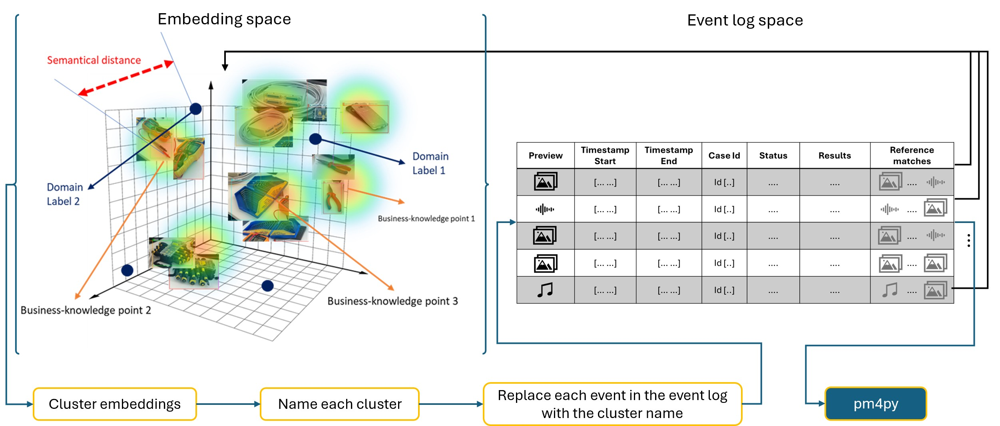

# Supplementary Material for the paper "Relaxing Process Mining for Operation in Embedding Spaces" (submitted to BPM25)

This repository demonstrates a **relaxed process mining** pipeline that integrates **embeddings**, **clustering**, **LLM-based labeling**, and **traditional process discovery** (via PM4Py). It provides a step-by-step implementation (in Python).

## Overview




## Script Variants-  `relaxed_process_mining.py` and `relaxed_process_mining_instance.py`

- **Embedding Method**  
  - **`relaxed_process_mining.py`**  
    - Demonstrates the *conceptual* flow using placeholder embeddings (random vectors or stubs). This file is ideal for understanding the pipeline’s steps without requiring a local embedding model.
  - **`relaxed_process_mining_instance.py`**  
    - Integrates **Ollama** and uses the **`nomic-embed-text`** model to generate *real* text embeddings. It therefore gives a more *practical* demonstration with actual embedding vectors.

- **Dependencies**  
  - `relaxed_process_mining.py` only needs PM4Py, `numpy`, `scikit-learn`, and `plotly` to run effectively.
  - `relaxed_process_mining_instance.py` additionally requires **Ollama** installed and **`ollama pull nomic-embed-text`** to fetch the embedding model.

- **Use Case**  
  - If you want to see a quick proof-of-concept *structure* (read XES, cluster, discover, etc.), run **`relaxed_process_mining.py`**—it won’t fail due to missing embedding models.
  - If you want to see the *complete pipeline* with *real embeddings* from a local language model environment, use **`relaxed_process_mining_instance.py`**.

---
# Pipeline Overview

This example provides a **relaxed process mining** pipeline that integrates:
- **Ollama Embeddings** (using the [`nomic-embed-text`](https://ollama.com/library/nomic-embed-text/blobs/c71d239df917) model)  
- **PM4Py** for process model discovery and conformance checking  
- **Hierarchical Clustering** for grouping related activities  
- **LLM-based Labeling** (as placeholders) for naming clusters  

With this pipeline, you can transform a text-first or multimodal-first event log into clusters of semantically similar events and then leverage traditional process mining techniques for **discovery** and **analysis**.

---

## Key Components

1. **Event Log Reading (XES)**  
   - We use [PM4Py](https://github.com/process-intelligence-solutions/pm4py/tree/release) to import XES logs.  
2. **Embedding Generation with Ollama**  
   - The script uses `nomic-embed-text` for text embeddings, called via `ollama.embeddings`.  
3. **Clustering & Labeling**  
   - Cluster embeddings with Agglomerative Clustering and optionally label clusters using a placeholder LLM method.  
4. **Process Mining**  
   - Discover a Petri net using **Inductive Miner** (or Alpha/Heuristic Miners) and visualize it with PM4Py.  
   - Perform **conformance checking** using token-based replay.  

---

## Requirements

- **Python Versions**: 3.9, 3.10, 3.11, 3.12, or 3.13  
- **Python Libraries**  
  ```bash
  pip install -U pm4py scikit-learn numpy plotly
  ```
- **Ollama** (for embeddings)  
  - Refer to [Ollama’s Documentation](https://ollama.ai).  
  - Pull the model `nomic-embed-text`:
    ```bash
    ollama pull nomic-embed-text
    ```
- **Clone this Repository**  
  ```bash
   wget -O relaxed-pm.zip https://anonymous.4open.science/api/repo/relaxed-pm-A7E4/zip
   unzip relaxed-pm.zip -d relaxed-pm
   cd relaxed-pm
 ```

---

## Usage

1. **Install Dependencies**  
   ```bash
   pip install -U pm4py scikit-learn numpy plotly
   # Make sure you have ollama installed as well
   ollama pull nomic-embed-text
   ```
2. **Run the Script**  
   - The main file is **`relaxed_process_mining_instance.py`**.  
   - Modify `xes_path` in `main()` if you’d like to point to a different XES file. By default, it uses:
     ```python
     xes_path = "pm4py/tests/input_data/receipt.xes"
     ```
   - Execute:
     ```bash
     python relaxed_process_mining_instance.py
     ```
3. **Process Outputs**:  
   - The script will:  
     1. Read the XES log  
     2. Embed event descriptions via Ollama  
     3. Cluster them & assign labels  
     4. Generate a Petri net and visualize it using PM4Py  
     5. Display a conformance score  

---

## Model & Library Licenses

- **`nomic-embed-text`**  
  - The Ollama model used in this pipeline is covered by [this license](https://ollama.com/library/nomic-embed-text/blobs/c71d239df917).  
- **PM4Py**  
  - Licensed under [Apache License 2.0](https://github.com/process-intelligence-solutions/pm4py/blob/release/LICENSE). Refer to their [repository](https://github.com/process-intelligence-solutions/pm4py) for details.


#### Repository License

This repository is covered under the terms in the [LICENSE](./LICENSE) file.  